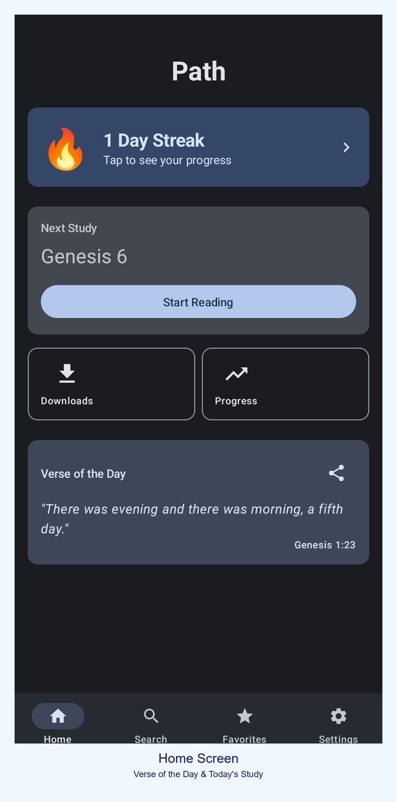
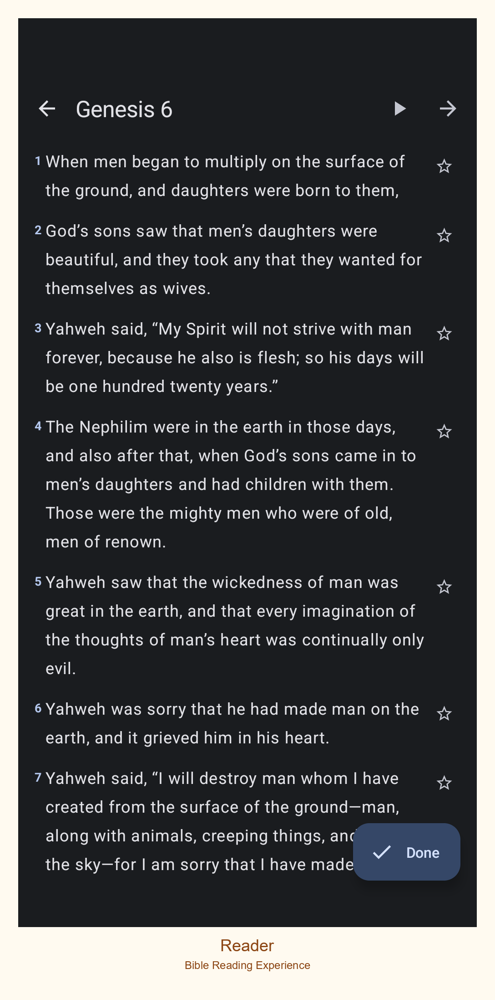
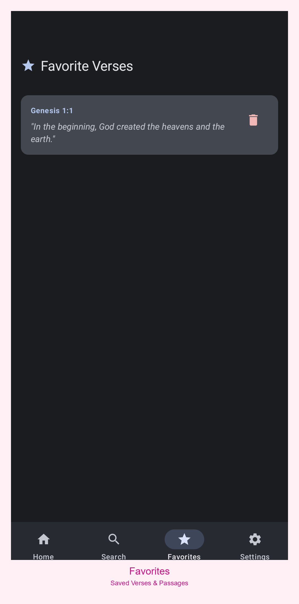
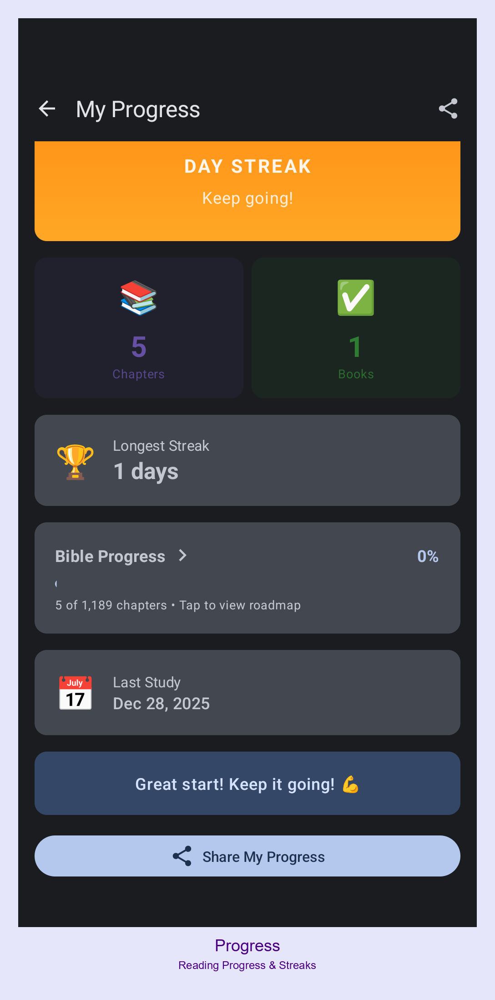

# Path - Bible Study App

<div align="center">
  
  
  [](https://youtube.com/shorts/H8feTTxo0aQ?feature=share)
</div>

A calm, mobile-first Bible study app that helps Christians stay focused and consistent through short daily study plans, gentle encouragement, and optional AI-powered insights.

## 📱 About

**Path** is an Android Bible study app designed to help new believers and long-time Christians build a consistent Bible reading habit. The app removes friction, reduces overwhelm, and encourages daily engagement through short, meaningful study sessions.

### Key Features

- **Daily Study Plans**: Sequential reading, book-based, topic-based, and devotional-style plans
- **Progress Tracking**: Reading progress, daily streaks, and gentle encouragement (Duolingo-inspired)
- **Notes & Highlights**: Write notes and highlight verses, all stored locally
- **Verse of the Day**: Daily featured verse on the home screen
- **Offline-First**: Works completely offline with no accounts required
- **Optional AI Integration**: Self-hosted Ollama support for verse explanations (off by default)
- **Text-to-Speech**: Listen to Bible passages with customizable voices
- **Home Screen Widgets**: Verse of the Day, progress tracking, and encouragement widgets

## 🎯 Mission

Help Christians build a consistent Bible study habit by removing friction, reducing overwhelm, and encouraging daily engagement in short, meaningful sessions (3-10 minutes).

## 🛠️ Technology Stack

- **Language**: Kotlin
- **UI Framework**: Jetpack Compose
- **Architecture**: MVVM with Manual Dependency Injection
- **Database**: Room (local persistence)
- **Preferences**: DataStore
- **Navigation**: Android Navigation Component
- **Widgets**: Glance AppWidget
- **Network**: Retrofit (for Bible API and optional Ollama integration)

## 📋 Requirements

- Android 8.0 (API level 26) or higher
- Android Studio Hedgehog or later
- JDK 17 or later

## 🚀 Getting Started

### Prerequisites

1. Clone this repository
2. Open the project in Android Studio
3. Sync Gradle files

### Building the App

```bash
# Build debug APK
./gradlew assembleDebug

# Build release APK
./gradlew assembleRelease

# Install debug build to connected device/emulator
./gradlew installDebug

# Clean build artifacts
./gradlew clean
```

### Running Tests

```bash
# Run unit tests
./gradlew test

# Run instrumented tests (requires connected device/emulator)
./gradlew connectedAndroidTest
```

## 📖 Usage

### First Launch

1. On first launch, the app will prompt you to set preferences:
   - Bible translation (default: WEB)
   - Daily study pace
   - Reminder time (optional)

2. The app defaults to a simple sequential Bible reading plan

### Daily Study Flow

1. Open the app to see the Verse of the Day and "Today's Study"
2. Tap "Start Reading" to view the assigned passage
3. Read the chapter, optionally add notes or highlights
4. Mark the study complete to update your streak
5. View your progress on the home screen

### Optional AI Setup

If you want to use AI-powered verse explanations:

1. Set up a local Ollama server (see [Ollama documentation](https://ollama.ai/))
2. In app Settings, enable AI
3. Enter your Ollama server URL (e.g., `http://192.168.1.100:11434`)
4. Fetch and select a model from your server
5. Use "Explain with AI" in the reader screen

**Note**: AI features are completely optional and the app works fully without them.

## 📸 Screenshots

<div align="center">
  
  
  
  
  
  
  
  
  
  
  
  
  
</div>

## 🏗️ Architecture

### Pattern: MVVM with Manual DI

- **UI**: Jetpack Compose with declarative UI
- **State Management**: StateFlow + Kotlin Flows
- **Navigation**: Android Navigation Component
- **Dependency Injection**: Manual DI in `PathApp.kt` (no Hilt/Dagger)
- **Database**: Room for local persistence
- **Preferences**: DataStore for settings

### Project Structure

```
app/src/main/java/com/path/app/
├── ui/                    # Presentation layer
│   ├── screens/          # Main screens with ViewModels
│   ├── components/       # Reusable UI components
│   └── theme/           # Material 3 theming
├── data/                  # Data layer
│   ├── local/           # Room database, DAOs, entities
│   ├── repository/      # Data abstraction
│   ├── remote/          # Retrofit API services
│   └── preferences/     # UserPreferences (DataStore)
├── domain/               # Domain models
│   └── model/          # Domain models (Verse, Chapter)
├── widget/              # Glance widgets
└── notifications/       # Study reminders
```

## 🔒 Privacy

**Path** is designed with privacy as a core principle:

- **No accounts required**: No login, no cloud sync
- **Local-only storage**: All data (notes, progress, preferences) stored on your device
- **Optional AI**: AI features connect only to your self-hosted Ollama server
- **No tracking**: No analytics, no data collection

See [PRIVACY.md](PRIVACY.md) for detailed privacy information.

## 🤝 Contributing

We welcome contributions! Please see [CONTRIBUTING.md](CONTRIBUTING.md) for guidelines on how to contribute to this project.

## 📄 License

This project is licensed under the MIT License - see the [LICENSE](LICENSE) file for details.

## 🙏 Acknowledgments

- Bible text sourced from [bible-api.com](https://bible-api.com/)
- Inspired by Duolingo's habit-building approach
- Built with modern Android development best practices

## 🗺️ Roadmap

- [ ] Plan switching (sequential, book-based, topic-based, devotional)
- [ ] Sharing (share verse, export notes)
- [ ] iOS version
- [ ] Encrypted local backups
- [ ] Additional home screen widgets
- [ ] Audio Bible integration

---

**Path** - Building consistent Bible study habits, one day at a time.

